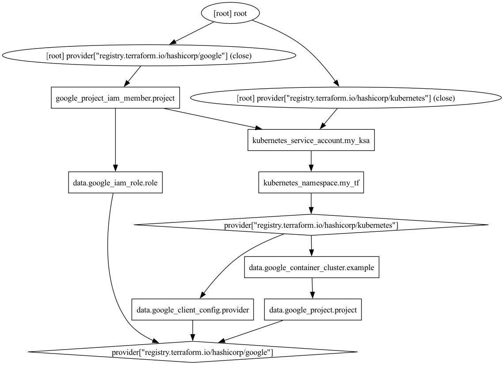

# terraform



```hcl
resource "google_project_iam_member" "project" {
  project = "jetstack-paul"
  role    = data.google_iam_role.role.name
  member  = "principal://iam.googleapis.com/projects/${data.google_project.project.number}/locations/global/workloadIdentityPools/${data.google_project.project.project_id}.svc.id.goog/subject/ns/${kubernetes_service_account.my_ksa.metadata[0].namespace}/sa/${kubernetes_service_account.my_ksa.metadata[0].name}"
}
```

## Apply

```sh
just apply
```

```sh
kubectl apply -f - <<EOF
apiVersion: v1
kind: Pod
metadata:
  name: test-pod
  namespace: example
spec:
  serviceAccountName: my-ksa
  containers:
  - name: test-pod
    image: google/cloud-sdk:slim
    command: ["sleep","infinity"]
    resources:
  nodeSelector:
    iam.gke.io/gke-metadata-server-enabled: "true"
EOF
```
