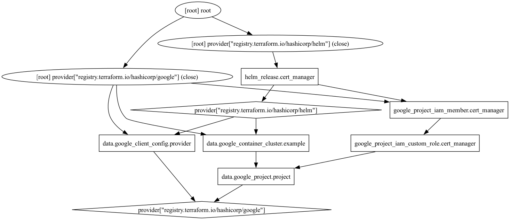

# terraform



```hcl
resource "google_project_iam_custom_role" "cert_manager" {
  project     = data.google_project.project.project_id
  role_id     = "cert_manager"
  title       = "Cert Manager"
  permissions = ["dns.resourceRecordSets.create", "dns.resourceRecordSets.list", "dns.resourceRecordSets.get", "dns.resourceRecordSets.update", "dns.resourceRecordSets.delete", "dns.changes.get", "dns.changes.create", "dns.changes.list", "dns.managedZones.list"]
}

resource "google_project_iam_member" "project" {
  project = data.google_project.project.project_id
  role    = google_project_iam_custom_role.cert_manager.name
  member  = "principal://iam.googleapis.com/projects/${data.google_project.project.number}/locations/global/workloadIdentityPools/${data.google_project.project.project_id}.svc.id.goog/subject/ns/cert-manager/sa/cert-manager"
}
```

## Apply

```sh
just apply
```

```sh
kubectl apply -f - <<EOF
apiVersion: cert-manager.io/v1
kind: Issuer
metadata:
  name: cloud-dns
spec:
  acme:
    email: paul.jones@jetstack.io
    server: https://acme-staging-v02.api.letsencrypt.org/directory
    privateKeySecretRef:
      name: issuer-account-key
    solvers:
    - dns01:
        cloudDNS:
          project: jetstack-paul
EOF
```

```sh
kubectl apply -f - <<EOF
apiVersion: cert-manager.io/v1
kind: Certificate
metadata:
  name: example-com
spec:
  secretName: example-com-tls
  issuerRef:
    name: cloud-dns
  dnsNames:
  - example.paul-gcp.jetstacker.net
EOF
```
